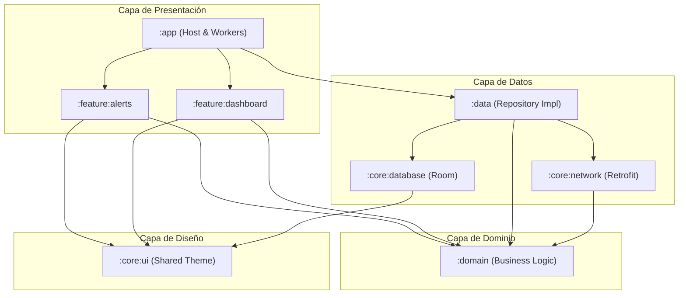

# Informe Técnico del Proyecto: SecAlerts (Lab06)

Este documento presenta un análisis y desglose técnico completo de la aplicación **SecAlerts**, una plataforma móvil diseñada en Android para la monitorización de vulnerabilidades y estado de seguridad de infraestructuras tecnológicas. Se detalla su arquitectura, la aplicación de los principios SOLID, la estructura modular, el funcionamiento de sus archivos, la integración de APIs externas, y las recomendaciones de capturas de pantalla.

---

## 1. Descripción General de la Aplicación

**SecAlerts** es una herramienta móvil de ciberseguridad que permite a los desarrolladores y administradores de sistemas registrar y auditar su stack tecnológico en tiempo real contra la base de datos oficial de vulnerabilidades **NVD (National Vulnerability Database)** del gobierno de EE.UU.

### Características Principales:
*   **Central de Vulnerabilidades (Alertas):** Listado interactivo de vulnerabilidades filtradas por niveles de severidad (Crítico, Alto, Medio, Bajo). Permite marcar alertas como "Corregidas" o "Reabiertas".
*   **Gestión del Stack Tecnológico (Mi Stack):** Sección donde se visualiza el inventario de software registrado (ej. Apache Tomcat, Spring Framework) junto con su respectiva versión y el número total de vulnerabilidades que le afectan.
*   **Registrador de Componentes:** Permite realizar búsquedas en tiempo real contra la API de NVD para analizar un componente específico y su versión antes de decidir guardarlo en el stack de la infraestructura.
*   **Dashboard de Seguridad Global:** Panel analítico que calcula un **Puntaje de Seguridad Global (0-100)** y una calificación ("A" a "F") mediante deducciones ponderadas por severidad, incluyendo gráficos de dona para severidades y barras para las tecnologías más afectadas.
*   **Sincronización en Segundo Plano (WorkManager):** Tarea periódica programada cada 24 horas que sincroniza la base de datos local (Room) con la API de NVD, analizando de forma inteligente la aparición de nuevas vulnerabilidades e informando al usuario mediante **Notificaciones Push** prioritarias en caso de encontrar riesgos.

---

## 2. Estructura del Proyecto (Clean Architecture & Modularización)

La aplicación implementa una arquitectura limpia (**Clean Architecture**) dividida en capas y estructurada a través de **módulos Gradle independientes**. Esto promueve la separación de conceptos, testabilidad, y scalabilidad.

### Diagrama de Dependencias entre Módulos:



### Descripción de Módulos:
1.  **`:domain`:** Contiene las entidades puras del negocio y la lógica de los Casos de Uso. Es un módulo de Kotlin puro sin dependencias de frameworks de Android, lo que garantiza que las reglas de negocio estén aisladas de la base de datos o la red.
2.  **`:data`:** Implementa la interfaz del repositorio definida en el dominio. Orquesta la transferencia de información entre el almacenamiento local y la fuente remota.
3.  **`:core:database`:** Contiene la configuración de Room, sus entidades y DAOs para la persistencia local fuera de línea.
4.  **`:core:network`:** Gestiona el cliente HTTP Retrofit, los esquemas JSON de respuesta de la API NVD, y contiene interceptores para simulación y caching.
5.  **`:core:ui`:** Módulo compartido para tokens de diseño como colores globales y el tema de Jetpack Compose.
6.  **`:feature:alerts`:** Módulo de interfaz de usuario que implementa las pantallas de visualización de alertas, stack tecnológico e ingresos/análisis de nuevos componentes.
7.  **`:feature:dashboard`:** Módulo enfocado exclusivamente en las métricas visuales del dashboard, cálculos de puntajes y gráficos de Compose.
8.  **`:app`:** El punto de entrada principal. Configura la inyección de dependencias de Dagger Hilt a nivel aplicación, define los workers de sincronización de fondo (WorkManager) y coordina la navegación de pestañas.

---

## 3. Catálogo de Archivos del Proyecto

A continuación se detalla la función específica de cada archivo fuente del proyecto, clasificados por módulo:

| Módulo | Ruta del Archivo | Función Principal |
| :--- | :--- | :--- |
| **`app`** | `MainActivity.kt` | Actividad única (Single Activity) que organiza la navegación global de Compose a través de una barra inferior (`NavigationBar`) y conecta las vistas con sus ViewModels mediante Hilt. |
| **`app`** | `SecAlertsApplication.kt` | Clase de aplicación que hereda de `Application`. Inicializa Hilt con `@HiltAndroidApp` y programa la tarea de fondo periódica con `WorkManager` con un intervalo de 24 horas. |
| **`app`** | `worker/AlertSyncWorker.kt` | Worker en segundo plano que descarga los datos actualizados de NVD, los compara con los registros antiguos para detectar nuevas vulnerabilidades y lanza una notificación push del sistema en caso de hallazgos. |
| **`core:database`**| `SecAlertsDatabase.kt` | Configuración abstracta de Room Database (versión 4) que expone los DAOs del sistema. |
| **`core:database`**| `entity/UserTechnologyEntity.kt`| Representación en base de datos de una tecnología monitoreada por el usuario (ID, nombre, versión). |
| **`core:database`**| `entity/VulnerabilityEntity.kt`| Representación en base de datos de una alerta CVE (ID, descripción, severidad, fecha, URL de referencia, estado de resolución, ID de tecnología vinculada). |
| **`core:database`**| `dao/UserTechnologyDao.kt` | Interfaz DAO con consultas SQLite para guardar, recuperar en flujo continuo (`Flow`), y eliminar registros de tecnologías. |
| **`core:database`**| `dao/VulnerabilityDao.kt` | Interfaz DAO para la inserción masiva de alertas, actualización de su estado de corrección, y transacciones de recarga (`clearAndInsertAlerts`). |
| **`core:database`**| `di/DatabaseModule.kt` | Módulo de Hilt que provee la instancia única de Room Database y sus DAOs al árbol de dependencias. |
| **`core:network`** | `api/CveApiService.kt` | Interfaz de Retrofit para consultar el endpoint JSON v2.0 de NVD filtrando por palabras clave (`keywordSearch`). |
| **`core:network`** | `api/CveDto.kt` & `NvdResponseDto.kt`| Clases DTO de Gson que mapean la compleja respuesta estructural de la API de NVD (vulnerabilidades, detalles de CVE, métricas CVSS 3.1, y referencias). |
| **`core:network`** | `api/MockInterceptor.kt` | Interceptor de OkHttp que intercepta peticiones HTTP para inyectar localmente respuestas mockadas y controladas de CVEs en formato JSON, útil para pruebas locales o desarrollo sin conexión. |
| **`core:network`** | `di/NetworkModule.kt` | Configura e inyecta OkHttpClient (con headers condicionales de API Keys), Retrofit y la clase `CveApiService`. |
| **`core:ui`** | `Theme.kt` & `Color.kt` | Definición de temas de colores adaptados a la ciberseguridad, incluyendo el mapeo de colores específicos por nivel de severidad de alertas. |
| **`domain`** | `model/UserTechnology.kt` | Modelo de datos de negocio puro que representa una tecnología en el stack del usuario. |
| **`domain`** | `model/VulnerabilityAlert.kt` | Modelo de datos de negocio puro que representa una alerta de seguridad (CVE). |
| **`domain`** | `repository/AlertRepository.kt` | Interfaz que abstrae todas las operaciones de datos necesarias para la lógica del dominio, logrando desacoplar el negocio de la implementación de datos física. |
| **`domain`** | `usecase/*` | Casos de uso específicos del dominio para interactuar con datos de forma atómica: `AddUserTechnologyUseCase`, `CheckTechnologyCvesUseCase`, `DeleteUserTechnologyUseCase`, `FilterAlertsBySeverityUseCase`, `GetAlertsUseCase`, `GetUserTechnologiesUseCase`, `ResolveAlertUseCase`, `SyncAlertsUseCase`, `VulnerabilityStatsUseCase`. |
| **`data`** | `repository/AlertRepositoryImpl.kt`| Implementación concreta del repositorio. Realiza peticiones de red vía Retrofit, gestiona la persistencia Room, transforma DTOs/Entities en modelos de Dominio, e implementa la lógica de mapeo y limpieza de datos. |
| **`data`** | `di/DataModule.kt` | Módulo de Hilt que realiza el binding de la interfaz del repositorio (`AlertRepository`) a la implementación (`AlertRepositoryImpl`). |
| **`feature:alerts`**| `AlertsViewModel.kt` | Mantiene el estado UI de las alertas. Escucha flujos reactivos, maneja filtros de severidad y gestiona la corrección de vulnerabilidades. |
| **`feature:alerts`**| `TechnologiesViewModel.kt` | ViewModel para gestionar el stack tecnológico. Controla los procesos asíncronos de búsqueda de CVEs y adición/eliminación de tecnologías. |
| **`feature:alerts`**| `AlertScreen.kt` | Pantalla que visualiza la central de vulnerabilidades filtrada por severity chips. |
| **`feature:alerts`**| `AlertItemCard.kt` | Composable animado que muestra la descripción del CVE, nivel de severidad, tecnología afectada, botón para abrir el parche oficial, y control para marcar como "Corregido". |
| **`feature:alerts`**| `MyStackScreen.kt` | Pantalla que visualiza el inventario tecnológico actual de la infraestructura del usuario con acordeones expandibles que muestran vulnerabilidades internas. |
| **`feature:alerts`**| `AddTechnologyScreen.kt` | Vista con formulario de texto para ingresar tecnologías y versiones con vista previa de vulnerabilidades encontradas por API antes del registro oficial. |
| **`feature:dashboard`**| `DashboardViewModel.kt` | Controla el flujo de estadísticas del panel analítico calculando porcentajes e índices. |
| **`feature:dashboard`**| `DashboardScreen.kt` | Interfaz interactiva y rica visualmente que dibuja gauges personalizados con Canvas, gráficos de dona animados para vulnerabilidades por severidad y barras de progreso horizontales para tecnologías comprometidas. |

---

## 4. Aplicación de los Principios SOLID

El diseño de software del Lab06 se ha alineado estrictamente con los principios **SOLID** para garantizar robustez y facilitar el mantenimiento de la aplicación:

### S - Single Responsibility Principle (Principio de Responsabilidad Única)
Cada clase realiza una única tarea bien definida dentro del ecosistema:
*   **Casos de Uso (`usecase/*`):** En lugar de tener una sola clase controladora para todas las alertas, cada caso de uso realiza una única tarea. Por ejemplo, [FilterAlertsBySeverityUseCase](file:///home/drajev/AndroidStudioProjects/Lab06/domain/src/main/java/com/example/domain/usecase/FilterAlertsBySeverityUseCase.kt) solo filtra vulnerabilidades, liberando al ViewModel de procesar estas transformaciones.
*   **Worker (`AlertSyncWorker`):** Tiene la única responsabilidad de gestionar la ejecución de sincronizaciones en segundo plano y disparar notificaciones del sistema.

### O - Open/Closed Principle (Principio de Abierto/Cerrado)
El código está diseñado para permitir extensiones sin modificar la base existente:
*   **Uso de Casos de Uso:** Si el negocio requiere cambiar la fórmula para calcular el Puntaje de Seguridad, basta con modificar o sustituir el caso de uso [VulnerabilityStatsUseCase](file:///home/drajev/AndroidStudioProjects/Lab06/domain/src/main/java/com/example/domain/usecase/VulnerabilityStatsUseCase.kt) sin alterar las pantallas UI ni los repositorios de datos.
*   **Interceptor de Red:** OkHttp permite agregar cabeceras o mockear peticiones mediante interceptores en su tubería de comunicación sin cambiar una sola línea de código dentro de la configuración del cliente Retrofit.

### L - Liskov Substitution Principle (Principio de Sustitución de Liskov)
Las subclases o implementaciones pueden sustituir a sus clases base o interfaces sin alterar el correcto funcionamiento del programa:
*   **Repositorio:** Los ViewModels y Casos de Uso consumen la abstracción de la interfaz [AlertRepository](file:///home/drajev/AndroidStudioProjects/Lab06/domain/src/main/java/com/example/domain/repository/AlertRepository.kt). Durante el tiempo de ejecución, Hilt inyecta [AlertRepositoryImpl](file:///home/drajev/AndroidStudioProjects/Lab06/data/src/main/java/com/example/data/repository/AlertRepositoryImpl.kt). Si decidiéramos sustituir la base de datos Room por Realm o Firebase en el repositorio de datos, la capa de dominio y presentación no notarían la diferencia y seguirían operando perfectamente.

### I - Interface Segregation Principle (Principio de Segregación de Interfaces)
Las interfaces de acceso a datos están divididas de manera que los clientes no dependen de operaciones que no utilizan:
*   **DAOs Segregados:** En la capa de datos local, contamos con [UserTechnologyDao](file:///home/drajev/AndroidStudioProjects/Lab06/core/database/src/main/java/com/example/core/database/dao/UserTechnologyDao.kt) y [VulnerabilityDao](file:///home/drajev/AndroidStudioProjects/Lab06/core/database/src/main/java/com/example/core/database/dao/VulnerabilityDao.kt). Si un componente solo necesita administrar el registro de tecnologías de usuario, interactúa exclusivamente con el primero sin verse forzado a instanciar o conocer métodos sobre resolución o filtrado de vulnerabilidades.

### D - Dependency Inversion Principle (Principio de Inversión de Dependencia)
Los módulos de alto nivel (como la lógica de negocio en el Dominio) no dependen de detalles de bajo nivel (como Retrofit o Room en Datos). Ambos dependen de abstracciones:
*   **Inyección en Dominio:** Los casos de uso requieren `AlertRepository` en su constructor. La interfaz reside en el módulo `:domain`. La implementación concreta (`AlertRepositoryImpl`) reside en el módulo `:data`.
*   **Inyección mediante Hilt:** La configuración en [DataModule](file:///home/drajev/AndroidStudioProjects/Lab06/data/src/main/java/com/example/data/di/DataModule.kt) declara explícitamente esta asociación:
    ```kotlin
    @Binds
    @Singleton
    abstract fun bindAlertRepository(
        alertRepositoryImpl: AlertRepositoryImpl
    ): AlertRepository
    ```

---

## 5. Manejo de la API de Vulnerabilidades (NVD)

La aplicación consume de forma dinámica la API v2.0 de la base de datos nacional de vulnerabilidades (NVD) gestionada por el NIST.

### URL Base de Consumo
```
https://services.nvd.nist.gov/rest/json/cves/2.0/
```

### Proceso de Mapeo e Ingesta de Datos:
1.  **Petición HTTP:** Se ejecuta a través de la interfaz [CveApiService](file:///home/drajev/AndroidStudioProjects/Lab06/core/network/src/main/java/com/example/core/network/api/CveApiService.kt) pasando el query estructurado por la tecnología y la versión en el parámetro `keywordSearch`.
2.  **DTO (Capa Network):** Retrofit parsea el JSON entrante a un objeto [NvdResponseDto](file:///home/drajev/AndroidStudioProjects/Lab06/core/network/src/main/java/com/example/core/network/api/NvdResponseDto.kt).
3.  **Procesamiento y Normalización (Capa Data):** El repositorio [AlertRepositoryImpl](file:///home/drajev/AndroidStudioProjects/Lab06/data/src/main/java/com/example/data/repository/AlertRepositoryImpl.kt) procesa los DTOs y extrae la información crítica:
    *   **ID del CVE:** Identificador único (ej. `CVE-2026-9091`).
    *   **Descripción:** Se busca el texto en español (`es`) y si no está disponible, se cae al idioma por defecto inglés (`en`).
    *   **Severidad:** Se lee la métrica CVSS v3.1 base severity y se traduce a su equivalente en español ("CRÍTICO", "ALTO", "MEDIO", "BAJO").
    *   **Enlace de Parche/Solución:** Se evalúan las referencias web para priorizar URLs que tengan la etiqueta `"patch"` en sus tags oficiales.
4.  **Entidad de Room (Capa Database):** Se guardan los registros mapeados como [VulnerabilityEntity](file:///home/drajev/AndroidStudioProjects/Lab06/core/database/src/main/java/com/example/core/database/entity/VulnerabilityEntity.kt) en la base de datos SQLite local para habilitar búsquedas reactivas offline.
5.  **Transformación a Dominio:** Se exponen como modelos de negocio puros [VulnerabilityAlert](file:///home/drajev/AndroidStudioProjects/Lab06/domain/src/main/java/com/example/domain/model/VulnerabilityAlert.kt) para su consumo final en la UI.

---

## 6. Código Fuente Importante y Crítico

### A. Sincronización Masiva en Repositorio (`AlertRepositoryImpl.kt`)
Esta rutina es el núcleo de la aplicación, ya que procesa secuencialmente todas las tecnologías registradas por el usuario para actualizar la base de datos en una sola transacción segura:

```kotlin
override suspend fun syncAlerts() {
    // 1. Obtener todas las tecnologías del stack del usuario
    val techs = userTechnologyDao.getUserTechnologiesFlow().first()
    if (techs.isEmpty()) {
        vulnerabilityDao.clearAlerts()
        return
    }

    val allAlerts = mutableListOf<VulnerabilityEntity>()
    
    // 2. Iterar e interrogar a la API de NVD por cada componente
    techs.forEach { tech ->
        val alerts = fetchCvesFromNetwork(tech.name, tech.version, tech.id)
        allAlerts.addAll(alerts)
    }

    // 3. Limpiar base de datos e insertar nuevas alertas en transacción
    vulnerabilityDao.clearAndInsertAlerts(allAlerts)
}
```

### B. Notificaciones en Segundo Plano (`AlertSyncWorker.kt`)
Compara el historial local de vulnerabilidades antes de la sincronización con las alertas recolectadas después del proceso remoto. Si detecta nuevos IDs, activa notificaciones push personalizadas:

```kotlin
override suspend fun doWork(): Result {
    val repository = EntryPointAccessors.fromApplication(
        applicationContext,
        AlertWorkerEntryPoint::class.java
    ).alertRepository()

    return try {
        // 1. Tomar foto del estado local previo
        val oldAlertIds = repository.getAlerts().first().map { it.id }.toSet()

        // 2. Ejecutar sync remoto
        repository.syncAlerts()

        // 3. Obtener alertas post-sync y filtrar las nuevas
        val newAlerts = repository.getAlerts().first()
        val newlyAdded = newAlerts.filter { !oldAlertIds.contains(it.id) }

        // 4. Si hay nuevas amenazas, notificar al usuario
        if (newlyAdded.isNotEmpty()) {
            val criticalCount = newlyAdded.count { it.severity.uppercase() == "CRÍTICO" }
            val highCount = newlyAdded.count { it.severity.uppercase() == "ALTO" }
            
            val title = "⚠️ Nuevas vulnerabilidades detectadas"
            val text = if (criticalCount > 0 || highCount > 0) {
                "Se detectaron ${newlyAdded.size} amenazas en tu stack ($criticalCount críticas, $highCount altas). ¡Revisa SecAlerts!"
            } else {
                "Se encontraron ${newlyAdded.size} alertas de severidad media/baja en tu infraestructura."
            }
            showNotification(title, text)
        }

        Result.success()
    } catch (e: Exception) {
        Result.retry()
    }
}
```

### C. Algoritmo de Cálculo de Seguridad (`VulnerabilityStatsUseCase.kt`)
Calcula las estadísticas del Dashboard evaluando únicamente las vulnerabilidades activas (no corregidas) del usuario, generando deducciones de puntaje según su nivel de gravedad:

```kotlin
operator fun invoke(): Flow<Stats> {
    return combine(
        repository.getAlerts(),
        repository.getUserTechnologies()
    ) { alerts, techs ->
        val initialSeverities = mapOf(
            "CRÍTICO" to 0,
            "ALTO" to 0,
            "MEDIO" to 0,
            "BAJO" to 0
        ).toMutableMap()

        // Filtrar alertas corregidas
        val activeAlerts = alerts.filter { !it.isResolved }

        activeAlerts.forEach { alert ->
            val key = alert.severity.uppercase()
            initialSeverities[key] = (initialSeverities[key] ?: 0) + 1
        }

        val techCounts = activeAlerts.groupBy { it.affectedTechnology }
            .mapValues { it.value.size }

        Stats(
            severityCounts = initialSeverities,
            technologyCounts = techCounts,
            userTechnologyCount = techs.size
        )
    }
}
```

---

## 7. Guía de Capturas de Pantalla Recomendadas para el Informe

Para ilustrar este reporte, se recomienda incluir capturas de pantalla reales en los siguientes puntos clave:

### Captura 1: Dashboard de Seguridad Global
*   **Dónde colocarla:** Al final de la *Sección 1 (Descripción General)* o en la *Sección 3 (DashboardScreen)*.
*   **Contenido visual:** La pantalla del Dashboard mostrando el gauge de puntuación (ej. "Puntaje 88", "Grado B"), el gráfico circular de dona en color rojo (Crítico), naranja (Alto), amarillo (Medio) y verde (Bajo), y la lista de barras de tecnologías comprometidas.
*   **Pie de foto sugerido:** *"Figura 1: Interfaz analítica del Dashboard de Seguridad con cálculo dinámico de puntuación global y gráficos estadísticos de severidad."*

### Captura 2: Central de Vulnerabilidades y Filtros
*   **Dónde colocarla:** En la *Sección 3 (AlertScreen)*.
*   **Contenido visual:** El listado de tarjetas CVE-XXXX-XXXX. Se debe mostrar una de las tarjetas expandida revelando el botón de *"Solución / Parche"* e *"Marcar como Corregido"*, junto con el uso de chips de severidad activos en la parte superior.
*   **Pie de foto sugerido:** *"Figura 2: Listado interactivo de vulnerabilidades de seguridad filtradas por nivel de severidad y detalle extendido de una alerta activa."*

### Captura 3: Formulario de Registro y Análisis en Tiempo Real
*   **Dónde colocarla:** En la *Sección 3 (AddTechnologyScreen)*.
*   **Contenido visual:** Formulario de entrada con datos de búsqueda (ej. "Apache Tomcat", versión "9.0.35") y el área de vista previa mostrando las alertas críticas de NVD detectadas para esa tecnología específica antes de confirmar su guardado.
*   **Pie de foto sugerido:** *"Figura 3: Proceso de análisis previo al guardado mediante consultas dirigidas a la base de datos de la API de NVD."*

### Captura 4: Notificación Push de Seguridad en el Sistema
*   **Dónde colocarla:** Al final de la *Sección 6.B (AlertSyncWorker)*.
*   **Contenido visual:** La barra de estado del sistema operativo Android mostrando el banner de la notificación de SecAlerts con el texto: *"⚠️ Nuevas vulnerabilidades detectadas: Se encontraron 2 amenazas en tu stack (1 crítica, 1 alta)..."*.
*   **Pie de foto sugerido:** *"Figura 4: Notificación de advertencia en el sistema Android disparada tras una sincronización en segundo plano."*
